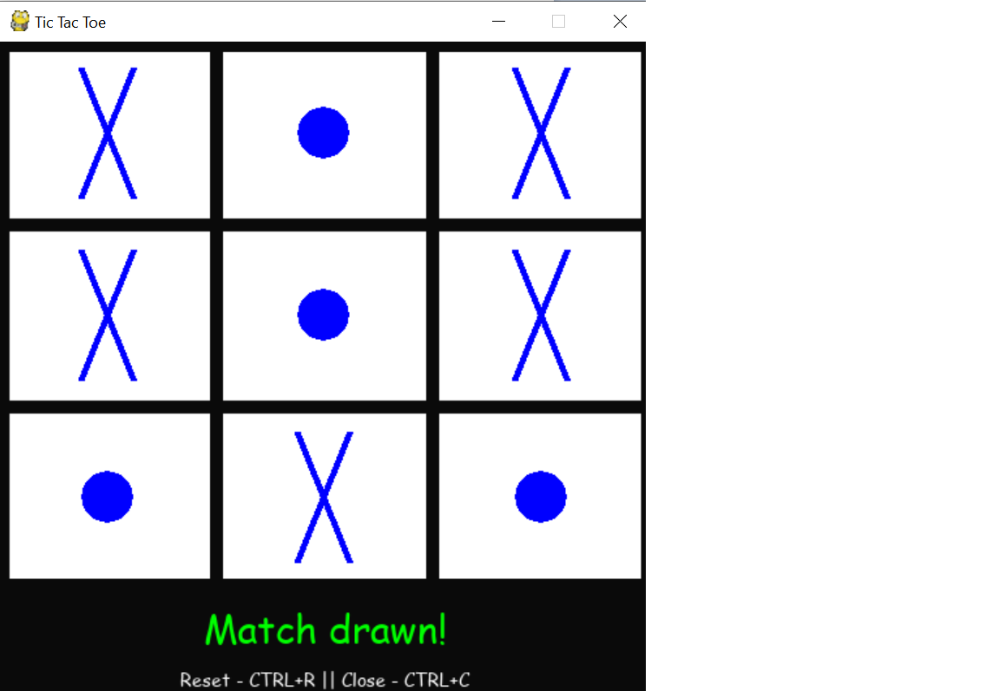

# TicTacToe

The old school game tried with a different User Interface and simplicity

### How to get into action quickly ?

1. Download(or)Pull the code from Github.
2. This application was designed on Python3.7, but should be fine with any version > Python3.5.
3. Since Pygame is a wrapper over the SDL libary, SDL should be configured appropiately.
4. Install pygame libary
    ```
    pip install pygame
    ```
5. Run the main game script.
    ```
    python scripts/init_app.py
    ```

### Some Screenshots of the Game


